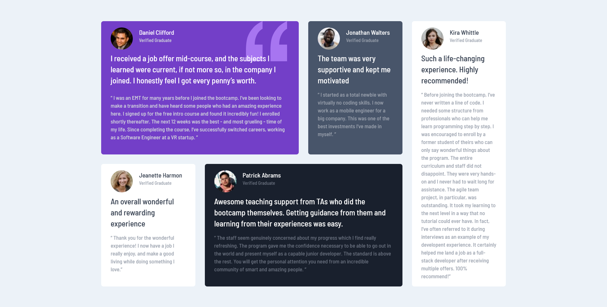

# Frontend Mentor - Testimonials grid section solution

This is a solution to the [Testimonials grid section challenge on Frontend Mentor](https://www.frontendmentor.io/challenges/testimonials-grid-section-Nnw6J7Un7). Frontend Mentor challenges help you improve your coding skills by building realistic projects. 

## Table of contents

- [Overview](#overview)
  - [The challenge](#the-challenge)
  - [Screenshot](#screenshot)
  - [Links](#links)
- [My process](#my-process)
  - [Built with](#built-with)
  - [What I learned](#what-i-learned)
  - [Useful resources](#useful-resources)
- [Author](#author)

## Overview

### The challenge

Users should be able to:

- View the optimal layout for the site depending on their device's screen size

### Screenshot

### Links

- Live Site: [Testimonial Grid Section](http://testimonials-grid-section-tau-ten.vercel.app/)

## My process

### Built with

- Semantic HTML5 markup
- Mobile-first workflow
- [Tailwind CSS](https://tailwindcss.com/)
- Flexbox
- CSS Grid

### What I learned

My first time using a CSS framework. Tailwindcss is very intuitive and easy to work with. I had fun and i enjoyed the whole process, from setting things up to learning the basic layout structure and class names. It was an easy challenge, quite basic grid layout!

### Useful resources

- [Tailwindcss docs](https://tailwindcss.com/docs/installation) - Definetely the best resource for guidance and class names reference.

## Author

- Frontend Mentor - [@Da-vi-de](https://www.frontendmentor.io/profile/Da-vi-de)
